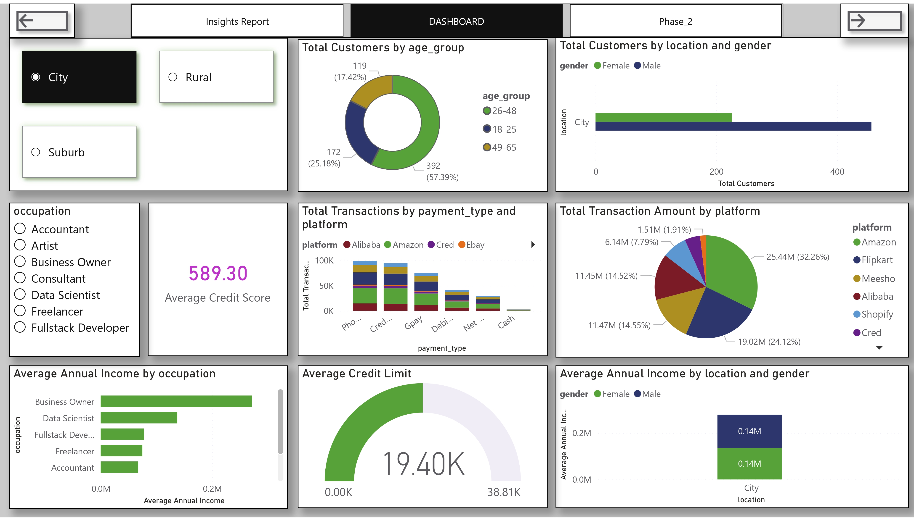
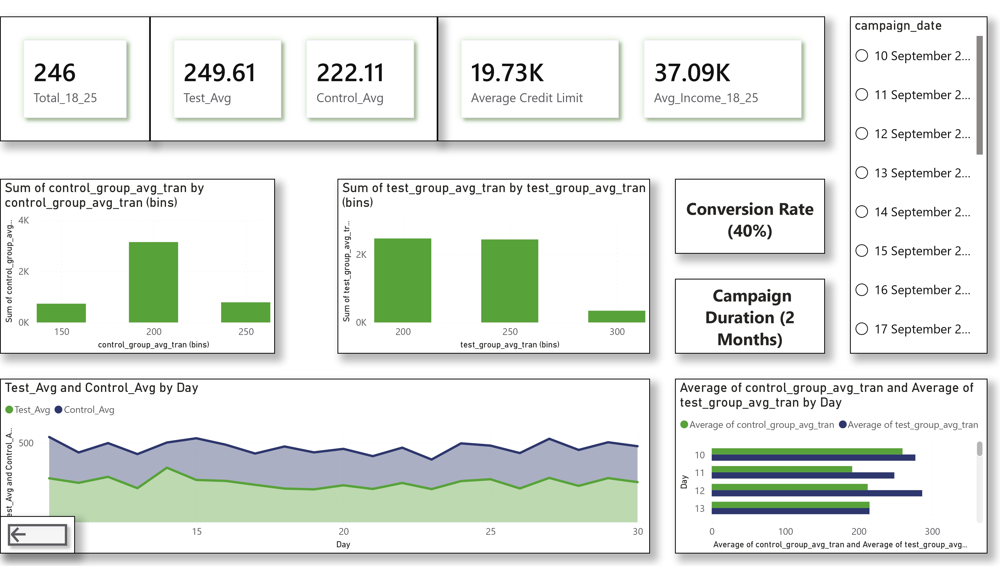

# Banking Customer Analysis & A/B Testing Campaign

## 📊 Live Dashboard
**[Click Here to View Live Interactive Dashboard →](https://app.powerbi.com/view?r=eyJrIjoiODdjMjRiNDEtODJiZS00MWEwLTkxZmYtMmQ1ODJkZTQyNjA0IiwidCI6ImJlNmRiMjQyLTRmZTctNDJiMi1hZTE1LTZkODQ4NmNkNDc3ZiJ9&pageName=bade5151302b08226d10)**

### Dashboard Preview

*Interactive dashboard analyzing customer segments, income patterns, and transaction behavior*

*Campaign performance metrics and conversion analysis*

## 🎯 Business Problem
Banking institution seeking to increase credit card activation and usage among younger customers with low credit history. Need to identify target segments and measure campaign effectiveness through controlled testing.

## 📈 Key Insights

### Phase 1 - Customer Insights
- **Target Segment**: 18-25 age group (26% of customer base)
- **Total Customers in Segment**: 246
- **Average Income**: ₹37.09K annually
- **Average Credit Score**: 589.30
- **Average Credit Limit**: ₹19.73K
- **Top Shopping Platform**: Amazon (₹25.44M, 32.26%)
- **Key Characteristics**: High online shopping engagement, low credit card usage

### Phase 2 - A/B Testing Results
- **Campaign Duration**: September - November 2023
- **Test Group Size**: 100 customers
- **Control Group Size**: 40 customers
- **Conversion Rate**: 40% (40 active users)
- **Test Group Avg Transaction**: ₹249.61
- **Control Group Avg Transaction**: ₹222.11
- **Effect Size**: 0.4 (Medium to Large impact)

## 🔧 Analysis Process
1. **Customer Segmentation**: Identified 18-25 age group with low credit history
2. **Market Analysis**: Analyzed income, occupation, location, and shopping patterns
3. **Campaign Design**: Power analysis determined sample sizes for A/B testing
4. **Performance Tracking**: Monitored transaction values and conversion rates
5. **Results Validation**: Statistical comparison of test vs control groups

## 📁 Files Included

- **BankingProject_CustomerAnalysis.pdf** – Comprehensive analysis report with visualizations  
- **phase_1_atliqo_bank.ipynb** / **phase_1_atliqo_bank.html** – Customer insights, segmentation, and credit analysis 

- **phase_2_atliqo_bank.ipynb** / **phase_2_atliqo_bank.html** – A/B testing campaign evaluation and statistical validation  

**Cleaning & Transformation Process added into jupyter as well as in html to direct view code+output without external installation like IDE/PYTHON just click html and open**

- **cleaned_datasets/** – Final cleaned datasets used in the project  
- **datasets/** – Raw input datasets before cleaning and transformation  
- **Project_SnapShot_1.jpg**, **Project_SnapShot_2.jpg**, **Project_SnapShot_3.jpg** – Dashboard preview snapshots  
- **image.png**, **analysis.png** – Supporting visuals used in documentation  
- **requirements.txt** – Python dependencies for executing notebooks  

## 💡 Key Recommendations
- Expand campaign to full 18-25 segment (246 customers)
- Focus acquisition on Electronics category shoppers
- Leverage Amazon and Flipkart partnerships for card promotions
- Implement targeted offers for low-income, high-engagement users
- Continue monitoring transaction patterns for sustained activation

## 🛠️ Tools Used
- **Python- Pandas-Matplotlib-Seaborn** - Data Cleaning & Transformation
- **Microsoft Power BI** - Dashboard & Visualization
- **Statistical Analysis** - Power analysis, A/B testing methodology
- **DAX** - Custom metrics and KPI calculations

## 📊 Customer Demographics
- **Age Groups**: 26-48 (57.39%), 18-25 (25.18%), 49-65 (17.42%)
- **Location Split**: City, Rural, Suburb
- **Top Occupations**: Business Owner, Data Scientist, Fullstack Developer, Freelancer, Accountant
- **Payment Preferences**: Phone Pe, Credit Card, GPay, Debit Card, Net Banking, Cash

## 🎯 Campaign Success Metrics
- 40% conversion rate achieved in test group
- 12.4% increase in average transaction value vs control
- Sustained engagement throughout 2-month campaign period
- Strong performance validation through controlled testing

---
*Dashboard is publicly accessible - no sign-in required*